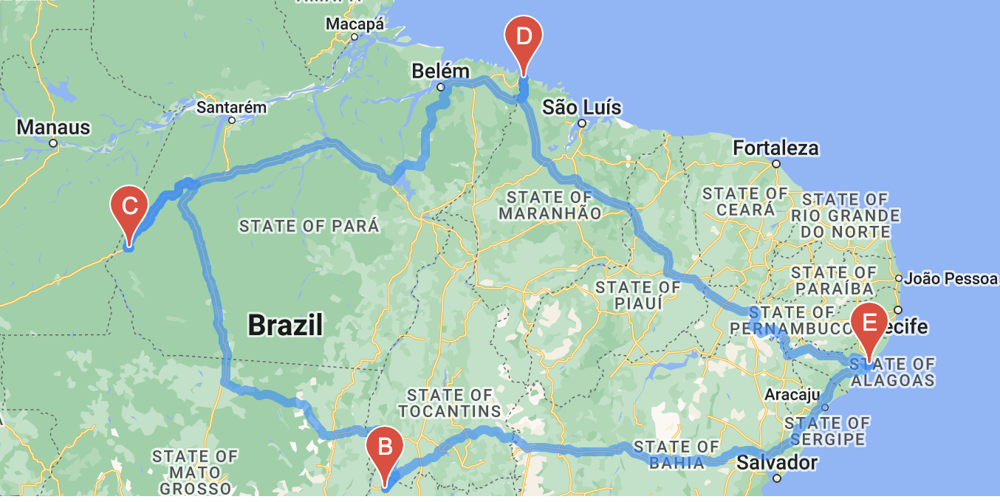
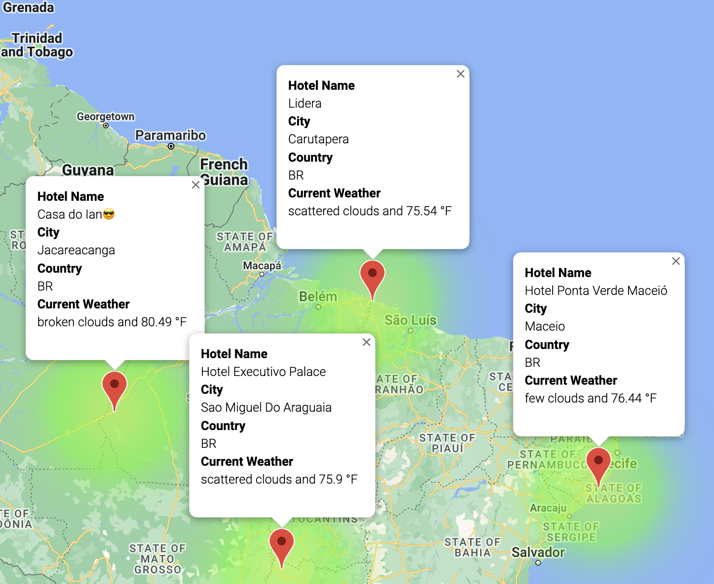

# World_Weather_Analysis
## Overview of the Analysis

## Results
### Retrieve Weather Data

### Create a Customer Travel Destination Map

### Create a Travel Itinerary Map

## Resources
* APIs 
  * OpenWeatherMap
  * Google Maps
  * Google Places
  * Google Directions
* Software: Python 3.9.12 | Jupyter Notebook 6.4.8
 
