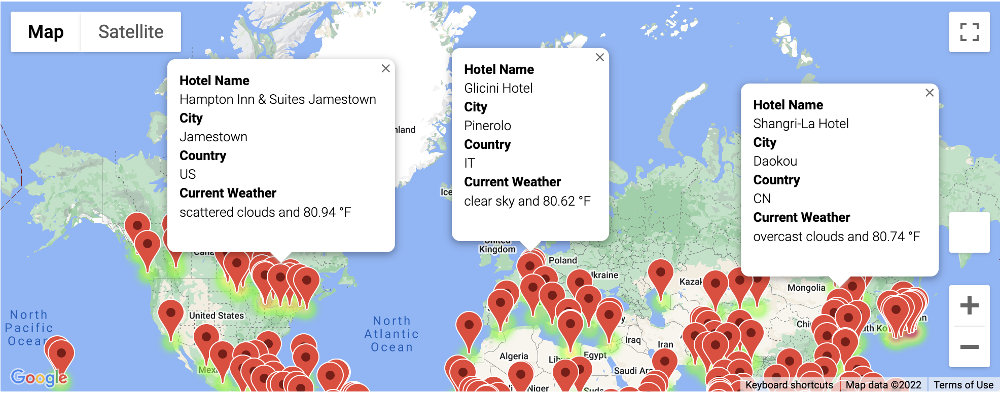

# World_Weather_Analysis
## Overview of the Analysis
The purpose of this analysis is to create a vacation map to identify potential travel destinations and nearby hotels based on user's weather preferences. By utilizing Google Maps Directions APIs, it also allows users to choose cities to create their travel itinerary.

The analysis is composed of three main stages: 
* Collect and analyze weather data across cities worldwide.
* Create a customer travel destinations map based on clients' weather preferences.
* Created a travel itinerary map based on clients' travel preferences. 

## Results
### Weather Database
I generated a set of 2,000 random latitudes and longitudes, retrieved the nearest cities from citipy module, and then performed an API call with the OpenWeatherMap to retrieve the following weather information for each of the 692 cities: latitude and longitude, maximum temperature, percent humidity, percent cloudiness, wind speed, and weather description. Lastly, I added the data to a new DataFrame and exported it as a [.csv file](Weather_Database/WeatherPy_Database.csv). 

### Vacation Search
I filtered the Pandas DataFrame based on user inputs for a minimum and maximum temperature (75-85°F), and identified 212 potential travel destinations and nearby hotels using Google's Maps and Places API, then created a marker layer map with pop-up markers for those destinations.

### Vacation Itinerary 
I used the Google Directions API and created a travel itinerary showing the route between four cities in Brazil chosen from the customer's possible travel destinations. 

Lastly, I created a marker layer map with a pop-up marker for each city on the itinerary. 

## Resources
* APIs 
  * OpenWeatherMap
  * Google Maps
  * Google Places
  * Google Directions
* Software: Python 3.9.12 | Jupyter Notebook 6.4.8
 
